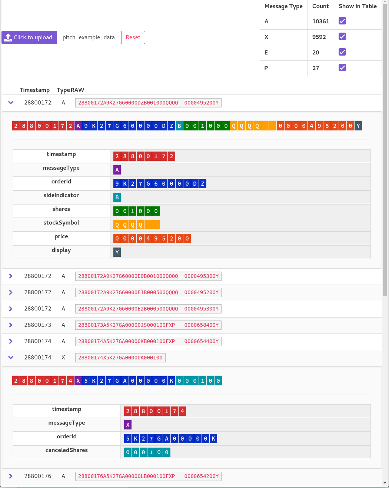
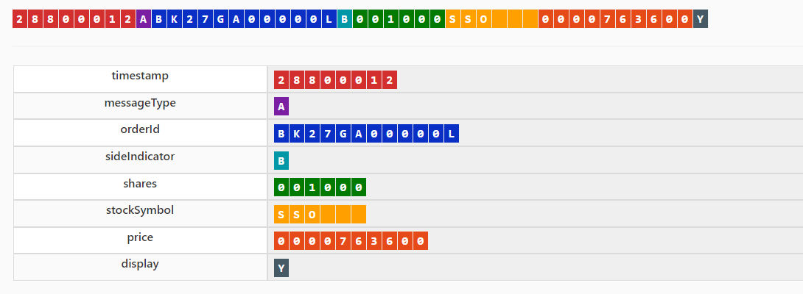

# CBOE PITCH Viewer
> Tools for parsing and viewing PITCH messages

[ONLINE DEMO](https://haydenbbickerton.github.io/cboe-viewer/)

Data file to upload for testing with online demo - [data_med](https://github.com/haydenbbickerton/cboe-viewer/blob/2ebf5e0abd77492c1af299da6b578180f372bb92/data_med)

----



## Overview

[CBOE](https://www.cboe.com/) provide services for rapidly trading stocks, and they publish [specifications](https://www.cboe.com/us/options/support/technical/) detailing their proprietary message formats - only available as PDFs :/ they also do not have software SDKs for public use. This repo addresses the issue by offering:

1. YAML files representing messages as defined from the official PDFs (only a few are done, as examples)
2. [Kaitai Struct](https://kaitai.io/) tooling, turning the YAMLs into SDKs for parsing data in Python/Javascript/C++/more
3. A Vue app that uses our new sdk for parsing uploaded data and viewing it in a debug environment

### Example

Example PITCH data feed:
```
S28800012ABK27GA00000LB001000SSO   0000763600Y
S28800012ABK27GA00000MS001000SSO   0000764800Y
S28800012AAK27GA0000DUS001000SDS   0000549300Y
S28800012AAK27GA0000DVB001000SDS   0000548000Y
...
```

The first line is an `Add Order (short) 4.3` message, for which we have:
1. [structs/specs/4.3-short.yml](structs/specs/4.3-short.yml) file defineing it's fields and their types
2. a [javascript file](structs/compiled/Cboe.js) with functions to parse 4.3 formatted data. the javascript file is generated by Kaitai
3. The Vue debugging tool will parse uploaded data and display the 4.3 message as: 


# Development

## Installation & Development

OS X & Linux:

```sh
$ cd /client
$ yarn install
yarn install v1.7.0
[1/4] Resolving packages...
[2/4] Fetching packages...
...
$ npm run serve
...
  App running at:
  - Local:   http://localhost:8080/
  - Network: http://10.0.0.200:8080/
```

# Notes
The code is in one of two steps:

 1. Converting the PITCH Message Specifications into usage python/javascript parsers/models
	 - `/structs/specs` - YAML's built by referencing the official PDF specs
	 -  `/notebooks/Building Structs.ipynb` - Notebook to build YAMLs into py/js models
 2. Web interface/app/viewer to view uploaded message data
	 - `/client/` - Vue.js app (pictured above)
	 - `/structs/compiled/Cboe.js` - Generated in  step 1 , imported by web app


Initially I went the route of making the python models and types for a backend parsing service, as I'm primarily a python developer. But copy-pasting each value into hardcoded classes when there's clearly an existing spec *somewhere* isn't what I'd normally do. So I did the YAMLs, and referenced those as the specs in the vue app. More about this in `Building Structs.ipynb`. I left code from initial run in `/cboe-sdk/` and `/notebooks/Modeling.ipynb`.


### Other
This feels very similar to [ACORD AL3]([https://www.acord.org/standards-architecture/acord-data-standards/Property_Casualty_Data_Standards#AL3](https://www.acord.org/standards-architecture/acord-data-standards/Property_Casualty_Data_Standards#AL3)), which is a popular [fixed length messaging standard]([https://www.ibm.com/support/knowledgecenter/en/SSMKHH_10.0.0/com.ibm.etools.mft.doc/ad09530_.htm](https://www.ibm.com/support/knowledgecenter/en/SSMKHH_10.0.0/com.ibm.etools.mft.doc/ad09530_.htm)) used by insurance software for the transmission of policies and claims. I created the AL3 implementation during my time at [BriteCore]([https://www.britecore.com/](https://www.britecore.com/)) .

The idea for the viewer comes from working with AL3, as there are thousands of different data/message types and no straightforward tool for displaying a feed of messages and their fields.


